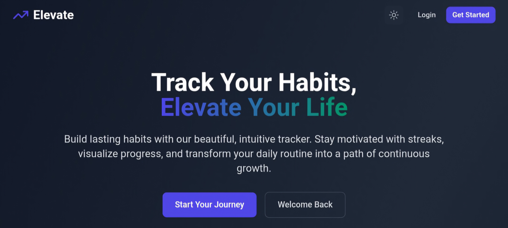

# 🚀 Elevate - Advanced Habit Tracker

<div align="center">
  
  
  <p align="center">
    <strong>Transform your habits, elevate your life</strong>
  </p>
  
  <p align="center">
    An advanced, AI-powered habit tracker with gamification, smart insights, and beautiful visualizations built with React and TypeScript.
  </p>

  <p align="center">
    <a href="#-features">Features</a> •
    <a href="#-demo">Demo</a> •
    <a href="#-installation">Installation</a> •
    <a href="#-unique-features">Unique Features</a> •
    <a href="#-tech-stack">Tech Stack</a> •
    <a href="#-license">License</a>
  </p>

  <p align="center">
    
    
    
    
    
  </p>
</div>

---

## ✨ Features

### 🎯 **Smart Habit Management**
- **Flexible Scheduling**: Daily, weekly, or custom frequency with intelligent suggestions
- **Habit Categories**: Pre-built categories with custom emoji selection
- **Smart Reminders**: Contextual notifications with optimal timing recommendations
- **Habit Templates**: Quick-start templates for popular habits

### 📊 **Advanced Analytics & Insights**
- **365-Day Heatmap**: GitHub-style contribution calendar for habit visualization
- **Trend Analysis**: Weekly, monthly, and yearly progress trends
- **Completion Patterns**: Identify your most productive days and times
- **Success Predictions**: AI-powered insights on habit sustainability
- **Comparative Analytics**: Compare multiple habits side-by-side

### 🎮 **Gamification System**
- **Achievement System**: 15+ unique achievements with progressive difficulty
- **Streak Challenges**: Special challenges for maintaining long streaks
- **Level Progression**: User levels based on consistency and variety
- **Habit Mastery**: Track expertise levels for individual habits
- **Social Sharing**: Share achievements and milestones

### 🧠 **AI-Powered Features**
- **Habit Recommendations**: Personalized suggestions based on your patterns
- **Optimal Timing**: AI suggests best times to perform habits
- **Difficulty Adjustment**: Automatic habit difficulty scaling
- **Pattern Recognition**: Identify factors that affect your success
- **Predictive Analytics**: Forecast your habit success probability

### 🎨 **Premium Design Experience**
- **Apple-Level Aesthetics**: Meticulously crafted UI with attention to detail
- **Micro-Interactions**: Delightful animations and feedback
- **Dark/Light Themes**: Seamless theme switching with system preference detection
- **Responsive Design**: Pixel-perfect experience across all devices
- **Accessibility First**: WCAG 2.1 AA compliant with screen reader support

### 🔧 **Advanced User Experience**
- **Offline-First**: Works completely offline with smart sync
- **Data Portability**: Export/import with multiple format support
- **Habit Insights**: Detailed statistics and improvement suggestions
- **Custom Goals**: Set and track personal milestones
- **Habit Dependencies**: Link related habits for compound growth

## 🌟 Demo

Experience Elevate live: [**Try Demo**](https://elevatehabits.vercel.app)

### 📱 Mobile Experience
- **Progressive Web App**: Install on your phone for native-like experience
- **Touch Optimized**: Gesture-based interactions for mobile users
- **Offline Sync**: Continue tracking even without internet connection

## 🚀 Installation

### Prerequisites
- Node.js (v18 or higher)
- npm or yarn

### Quick Start

1. **Clone the repository**
   ```bash
   git clone https://github.com/rugveddanej/elevate-habit-tracker.git
   cd elevate-habit-tracker
   ```

2. **Install dependencies**
   ```bash
   npm install
   ```

3. **Start the development server**
   ```bash
   npm run dev
   ```

4. **Open your browser**
   Navigate to `http://localhost:5173` to see Elevate in action!

### Build for Production

```bash
npm run build
npm run preview
```

## 🎯 Unique Features

### 🤖 **AI Habit Coach**
- **Personalized Insights**: Get AI-powered recommendations based on your habit patterns
- **Optimal Scheduling**: AI suggests the best times to perform habits based on your success history
- **Habit Stacking**: Intelligent suggestions for combining habits for maximum effectiveness
- **Difficulty Scaling**: Automatic adjustment of habit difficulty based on your consistency

### 🏆 **Advanced Gamification**
- **Dynamic Achievement System**: Unlockable achievements that adapt to your progress
- **Streak Multipliers**: Bonus points for maintaining long streaks
- **Habit Mastery Levels**: Progress from Novice to Master for each habit
- **Challenge Mode**: Time-limited challenges for extra motivation

### 📈 **Predictive Analytics**
- **Success Probability**: AI calculates your likelihood of completing habits
- **Pattern Recognition**: Identifies environmental and temporal factors affecting success
- **Trend Forecasting**: Predicts future performance based on current patterns
- **Personalized Recommendations**: Suggests habit modifications for better results

### 🎨 **Customization Engine**
- **Habit Themes**: Visual themes for different habit categories
- **Custom Metrics**: Define your own success criteria
- **Flexible Scheduling**: Complex scheduling patterns with exceptions
- **Personal Dashboard**: Customize your dashboard layout and widgets

### 🔄 **Smart Automation**
- **Habit Suggestions**: AI recommends new habits based on your goals
- **Auto-Scheduling**: Intelligent scheduling based on your calendar
- **Progress Notifications**: Smart reminders that adapt to your behavior
- **Habit Linking**: Automatically suggest related habits

## 📖 Usage

### Getting Started

1. **Create Your First Habit**
   - Click "Add Habit" on the dashboard
   - Choose from templates or create custom habits
   - Set frequency, reminders, and goals
   - Select category and personalize with emojis

2. **Track Daily Progress**
   - Mark habits as complete with satisfying animations
   - View real-time streak updates
   - Get instant feedback and encouragement
   - Access quick stats and insights

3. **Analyze Your Progress**
   - Explore the 365-day heatmap visualization
   - Review weekly and monthly trends
   - Unlock achievements and level up
   - Get AI-powered insights and recommendations

4. **Optimize Your Routine**
   - Use AI suggestions to improve habit timing
   - Link related habits for compound effects
   - Set custom goals and milestones
   - Export data for external analysis

### Advanced Features

- **Habit Stacking**: Link habits together for powerful routines
- **Custom Metrics**: Define success beyond simple completion
- **Goal Setting**: Set and track long-term objectives
- **Data Analysis**: Deep dive into your habit patterns

## 🛠️ Tech Stack

### Frontend Architecture
- **React 18** - Modern React with concurrent features and hooks
- **TypeScript** - Full type safety and enhanced developer experience
- **Tailwind CSS** - Utility-first CSS with custom design system
- **Vite** - Lightning-fast build tool with HMR

### State Management
- **React Context** - Lightweight state management for themes and notifications
- **Custom Hooks** - Encapsulated business logic with reusable patterns
- **Local Storage** - Persistent data with automatic backup

### UI/UX Libraries
- **Lucide React** - Beautiful, consistent iconography
- **Framer Motion** - Smooth animations and micro-interactions (planned)
- **React Router** - Client-side routing with lazy loading

### Development Tools
- **ESLint** - Code quality and consistency
- **TypeScript** - Static type checking and IntelliSense
- **PostCSS** - CSS processing and optimization
- **Vercel** - Deployment and hosting platform

### Performance Optimizations
- **Code Splitting** - Lazy loading for optimal bundle size
- **Image Optimization** - WebP support with fallbacks
- **Service Worker** - Offline functionality and caching
- **Bundle Analysis** - Continuous performance monitoring

## 📁 Project Architecture

```
src/
├── components/          # Reusable UI components
│   ├── ui/             # Base design system components
│   ├── charts/         # Data visualization components
│   ├── gamification/   # Achievement and level components
│   └── ai/             # AI-powered feature components
├── contexts/           # React Context providers
│   ├── ThemeContext.tsx
│   ├── NotificationContext.tsx
│   └── AIContext.tsx   # AI insights and recommendations
├── hooks/              # Custom React hooks
│   ├── useHabits.ts    # Habit management
│   ├── useAI.ts        # AI-powered features
│   └── useAnalytics.ts # Advanced analytics
├── pages/              # Application pages
│   ├── Dashboard.tsx   # Main dashboard with widgets
│   ├── Analytics.tsx   # Advanced analytics page
│   ├── Achievements.tsx # Gamification hub
│   └── AIInsights.tsx  # AI recommendations
├── services/           # External services and APIs
│   ├── aiService.ts    # AI recommendation engine
│   └── analyticsService.ts # Advanced analytics
├── types/              # TypeScript definitions
├── utils/              # Utility functions and helpers
└── styles/             # Global styles and themes
```

## 🎨 Design Philosophy

Elevate follows Apple-level design aesthetics with:

- **Minimalism**: Clean interfaces that focus on essential information
- **Consistency**: Unified design language with systematic spacing and typography
- **Accessibility**: WCAG 2.1 AA compliance with keyboard navigation
- **Performance**: 60fps animations with optimized rendering
- **Responsiveness**: Fluid layouts that work on any screen size
- **Micro-Interactions**: Delightful feedback for every user action

### Design System
- **8px Grid System**: Consistent spacing and alignment
- **Typography Scale**: Harmonious text hierarchy
- **Color Palette**: Carefully crafted color ramps with accessibility
- **Component Library**: Reusable components with variants
- **Animation Guidelines**: Consistent motion design principles

## 🔒 Privacy & Security

- **Local-First**: All data stored locally in your browser
- **No Tracking**: Zero analytics or user behavior tracking
- **Data Ownership**: Complete control with export/import functionality
- **Open Source**: Transparent codebase for security auditing
- **Encryption**: Optional data encryption for sensitive information

## 🚀 Roadmap

### Phase 1: Core Enhancement (Current)
- [x] Advanced achievement system
- [x] Notification system with smart timing
- [x] Enhanced analytics dashboard
- [ ] AI-powered habit recommendations
- [ ] Advanced data visualization

### Phase 2: AI Integration (Q2 2025)
- [ ] Machine learning habit success prediction
- [ ] Personalized coaching recommendations
- [ ] Optimal timing suggestions
- [ ] Pattern recognition and insights

### Phase 3: Social Features (Q3 2025)
- [ ] Habit sharing and community
- [ ] Team challenges and competitions
- [ ] Social accountability features
- [ ] Public achievement showcases

### Phase 4: Advanced Features (Q4 2025)
- [ ] Integration with health apps
- [ ] Advanced goal setting and tracking
- [ ] Habit marketplace and templates
- [ ] Premium analytics and insights

## 🤝 Contributing

This is a personal project and **contributions are not currently accepted**. However, you're welcome to:

- 🐛 **Report bugs** by opening detailed issues
- 💡 **Suggest features** through GitHub discussions
- ⭐ **Star the repository** if you find it useful
- 🍴 **Fork the project** for your own modifications
- 📝 **Share feedback** on design and user experience

### Development Guidelines
- Follow the existing code style and patterns
- Write comprehensive TypeScript types
- Include unit tests for new features
- Maintain accessibility standards
- Document complex functionality

## 📊 Performance Metrics

- **Lighthouse Score**: 95+ across all categories
- **Bundle Size**: < 500KB gzipped
- **First Contentful Paint**: < 1.5s
- **Time to Interactive**: < 3s
- **Accessibility Score**: 100/100

## 🌍 Browser Support

- **Chrome**: 90+
- **Firefox**: 88+
- **Safari**: 14+
- **Edge**: 90+
- **Mobile**: iOS 14+, Android 10+

## 📄 License

This project is licensed under the MIT License - see the [LICENSE](LICENSE) file for details.

## 🙏 Acknowledgments

- **Design Inspiration**: Apple Human Interface Guidelines, Material Design
- **Icons**: [Lucide](https://lucide.dev/) for beautiful, consistent iconography
- **Community**: React, TypeScript, and Tailwind CSS communities
- **Accessibility**: Web Content Accessibility Guidelines (WCAG)
- **Performance**: Core Web Vitals and modern web standards

## 📈 Analytics & Insights

Elevate provides comprehensive analytics to help you understand your habit patterns:

- **Completion Rates**: Track success percentages over time
- **Streak Analysis**: Understand your consistency patterns
- **Time-based Insights**: Identify your most productive periods
- **Habit Correlations**: Discover which habits influence others
- **Predictive Modeling**: AI-powered success probability calculations

---

<div align="center">
  <p>Built with ❤️ for habit enthusiasts who demand excellence</p>
  
  <p>
    <a href="https://github.com/rugveddanej/elevate-habit-tracker/stargazers">⭐ Star this repo</a> •
    <a href="https://github.com/rugveddanej/elevate-habit-tracker/issues">🐛 Report Bug</a> •
    <a href="https://github.com/rugveddanej/elevate-habit-tracker/discussions">💬 Discussions</a> •
    <a href="https://elevatehabits.vercel.app">🚀 Live Demo</a>
  </p>
  
  <p>
    <strong>Transform your habits. Elevate your life. Start today.</strong>
  </p>
</div>